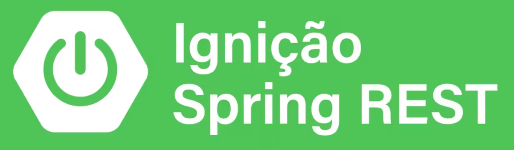

# Ignição Sprig REST

	   

## Conteúdo programático 📖

### 1. Fundamentos de REST e Spring

1.1. Boas vindas e as oportunidades do mercado
1.2. Quem é você? Quem sou eu?
1.3. Alguns combinados antes de continuar
1.4. O que é uma API?
1.5. O que é REST?
1.6. Conhecendo o protocolo HTTP
1.7. Entendendo os Recursos REST
1.8. Identificando recursos REST
1.9. Por que Spring?
1.10. Conhecendo o ecossistema de projetos Spring
1.11. Estudos de caso

